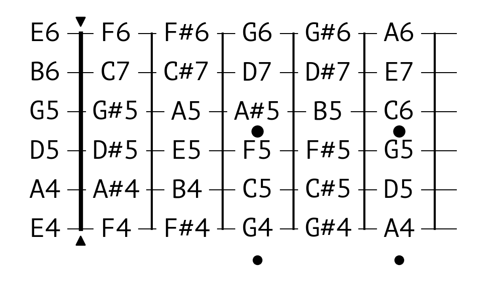

<p align="center">

<h1 align="center"> OMUSIC</h1>
</p>

A computerisation of Western music theory.

See [this Notebook file](music_theory.ipynb) for a tutorial of this library. Please see the table below for more tutorials.

## Components

This library has the following modules:

| Module         | Components                                                   | Turorial                                                  |
| -------------- | ------------------------------------------------------------ | --------------------------------------------------------- |
| omusic         | Definition of the music space; functions that operate on single notes; | [Link](./docs/source/guides/examples/music_theory.ipynb)  |
| omusic.modes   | Patterns of interval. Examples are `MAJOR`, `HARMONIC_MINOR` and `IONIAN`. | &#x2013;                                                  |
| omusic.scale   | Functions that construct scales.                             | &#x2013;                                                  |
| omusic.chord   | Functions that construct chords                              | &#x2013;                                                  |
| omusic.guitar  | Functions that map notes to a visual fret board.             | [Link](./docs/source/guides/examples/guessguitarer.ipynb) |
| omusic.midi    | Functions that play notes. Compatible with `.scale` and `.chord`. Can also accept manually specified notes. | [Link](./docs/source/guides/examples/midi.ipynb)          |
| omusic.guesser | Function to guess a scale or a chord based on a set off notes. | [Link](./docs/source/guides/examples/guesser.ipynb)       |

## Installation

Install from PyPI:

```bash
pip install omusic
```

Install from source:

```bash
# move to the root directory
pip install .
```

